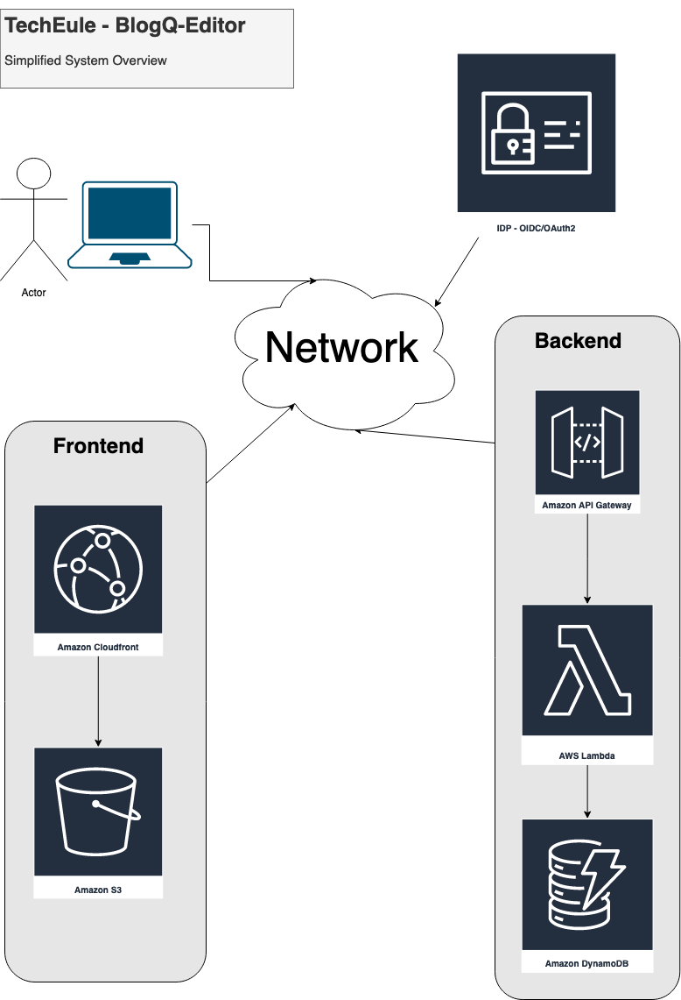

# TechEule - BlogQ: A Modern Blogging System

Welcome to TechEule's BlogQ repository, a part of a blogging system.
This part of the blogging system (_BlogQ-Editor_) serves as the editor 📝 for the blogging system.
It is intended to be a demo/showcase and template for workshops and blog posts on https://TechEule.com. 
It was developed using Java, Eclipse-MicroProfile 6.0, Typescript, Redux (Redux-Toolkit), and Bulma.io. 
The application is deployed in the AWS Cloud using the AWS Cloud Development Kit (CDK) as Infrastructure as Code (IaC).

## The BlogQ-Editor

### Backend
First, the Backend exposes a web-API to manage blog posts. 
It is built using Java with Eclipse-MicroProfile 6.0, running on Quarkus.io version 3.x. 
The backend can be deployed using AWS Lambda and is exposed via Amazon API Gateway. 
The source code can be found in the [cdk](cdk) maven submodule. 
DynamoDB serves as the datastore, and the Backend is split into [blogq-engine)](blogq-engine), [blogq-app](blogq-app), and [blogq-backend](blogq-backend).

### Frontend
Second, the static web GUI ([blogq-web-ui](blogq-web-ui)) runs in the user's browser. 
It is built using Typescript, Lit-HTML, Redux (Redux-Toolkit), and Bulma.io. 
The frontend is deployed in an AWS S3 bucket and served by AWS CloudFront.

### Security
The BlogQEditor is secured using JWT (OpenId Connect/OAuth2).

### CI/CD
Jenkins is used for CI/CD automation.

### System Overview



> All provided paths in this file are relative to the root-folder
> of this git-repository.

At [TechEule.com](https://techeule.com/) you can find more info about this repository.

## Requirements

- JDK version 17 or newer
- Maven 3.8.2 or newer
- Docker

## How to run and build this project

## Build

```shell
./mvnw clean package -DskipTests
```

### Build the Docker image

```shell
./mvnw clean package -DskipTests

docker build --progress plain -t t12s/t12s-blogq-quarkus -f ./blogq-backend/src/main/docker/Dockerfile.jvm .
```

## System Test

The application - _blogq-backend_ - should be up and running

```shell
./mvnw clean package -DskipTests && ./environment/build-and-start-env.sh 
```

Wait until the service get deployed and available at `http://localhost:51080/q/health`.

```shell
# Quarkus
./mvnw -V -T 1C clean test-compile failsafe:integration-test failsafe:verify -pl :t12s-blogq-st -Dmp.config.profile=quarkus
```

### Pre-push check

```shell
./mvnw -V -T 1C clean package && \
./environment/build-and-start-env.sh && \
sleep 20 && \
./mvnw -V -T 1C failsafe:integration-test failsafe:verify -pl :blogq-st -Dmp.config.profile=quarkus && \
./environment/stop-infra.sh
```

## Resources

- [Amazon API Gateway](https://aws.amazon.com/api-gateway/)
- [AWS Lambda](https://aws.amazon.com/lambda/)
- [Amazon DynamoDB](https://aws.amazon.com/dynamodb/)
- [Amazon CloudFront](https://aws.amazon.com/cloudfront/)
- [Amazon S3](https://aws.amazon.com/s3/)
- [Bulma.io](https://bulma.io/)
- [TechEule.com](https://techeule.com/)
